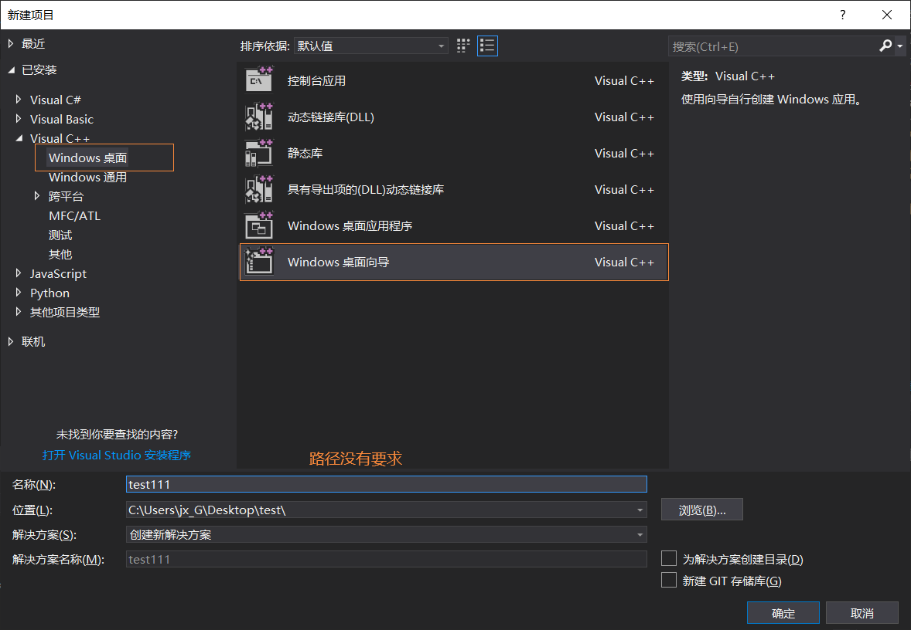
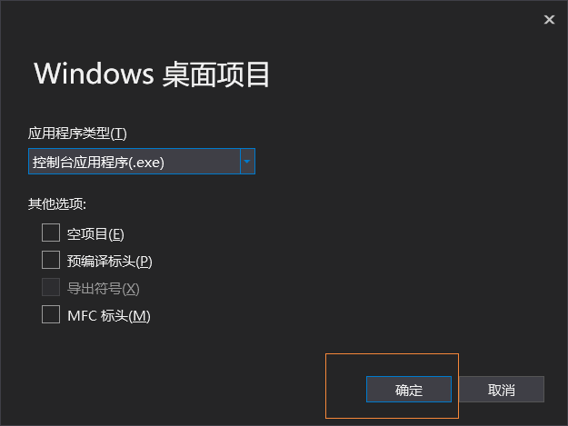
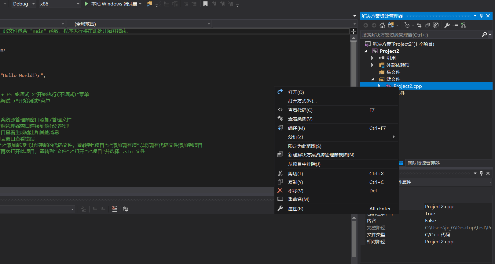
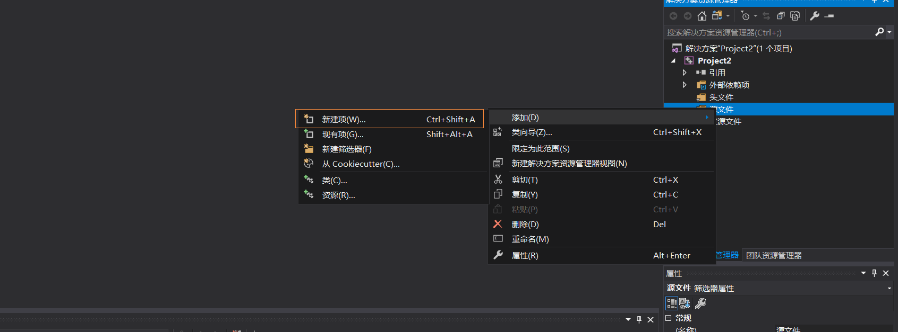
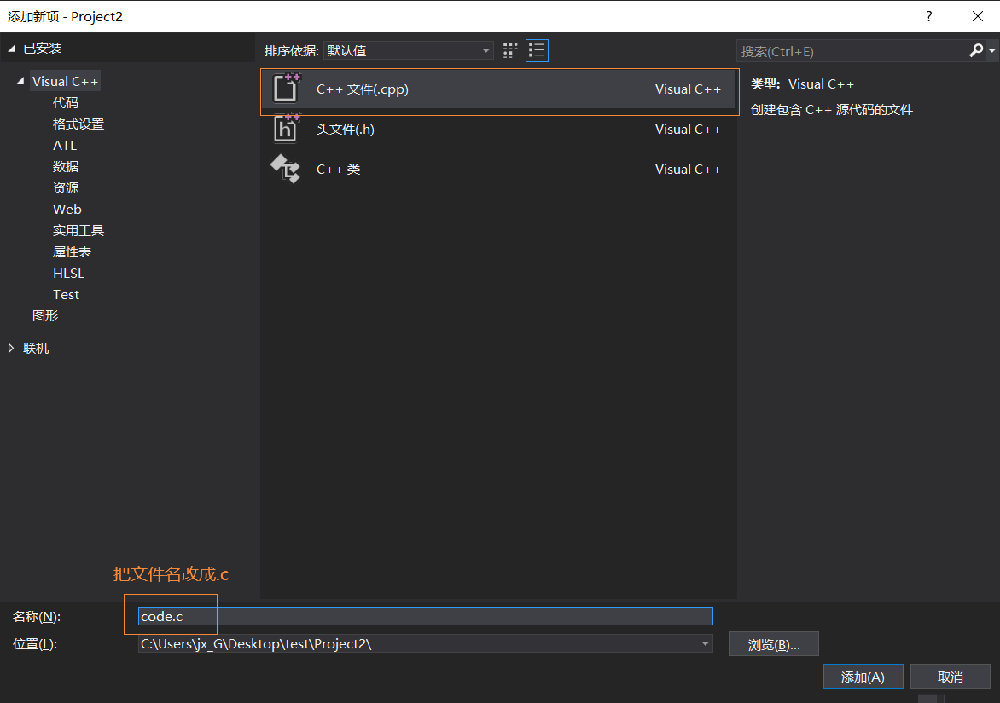
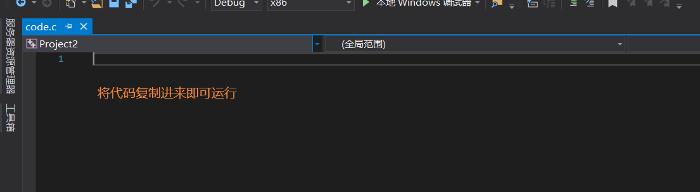

# 测试说明

##### 通过测试发现，从github直接下载整个项目后，程序不能正常运行。

##### 而且，新建项目后，还会出现种种问题

### 因此，给出如下测试说明（按照如下操作即可）：

- 首先创建一个桌面向导（必须是桌面向导）

- 删除自动创建的.cpp文件

- 右键源文件-->添加-->新建项（**注：如果把.c复制到项目中，直接添加现有项，程序不能正常运行**）

- **只能把代码复制进来，可以通过测试！**

### 最后，将github下载文件夹中的数据文件(.csv)，与.c文件放在同一路径下（注：是同一文件夹，只添加到VS的资源文件还是会报错的），即可正常运行
