# **小程序基础**

## **微信小程序**

### 1.什么是微信小程序？

- 微信小程序，简称：小程序
- 实现了应用“触手可及”的梦想 
- 不需要下载安装即可使用
- 用户扫一扫或搜一下即可打开

### 2.腾讯为什么出小程序？

- 微信应该有一种新的形态

- 不应该只是停留在**公众号**，不应该只是提供一种订阅能力，一种推送能力

- 而是应该提供更多**新的能力**，这种新的能力更加像一种**应用程序**的能力

  

### 3.小程序能做什么？

- 订阅号：	
  
- 例如，可以简单的发送消息，达到宣传效果。
  
- 服务号：	
  
- 例如，可以进行商品销售，进行商品售卖。
  
- 小程序：

  - 满足一个特定的需求，这个需求应该是真实存在的。

  - 例如，查天气，翻译，查汽车报价 , 查公交，点餐  , 娱乐小游戏...

    

### 4.微信小程序的定位？

- 体验比网站好
  - 底层可以调用原生的各种接口，像网络状态、罗盘，重力，拨打电话...
  - 界面解析使用虚拟`dom`技术( 例如：`wxml` 转化为 `html` )

- 下载比`APP`更便捷

  - 无须安装、触手可及、用完即走、无须卸载

    

### 5.微信小程序会颠覆传统`APP`？

- 微信小程序短期内**很难赶上**原生`APP`的用户体验

- 微信话事，小程序会也像公共号一样受**诸多限制**（仅能在微信推广）

- 微信小程序与原生的`APP`会相辅相成

  （**大前端**）

  

### 6.如何开发微信小程序？

- **主要用到的技术：** （**微信小程序提供的语言**）
  - 页面布局：`WXML` （`HTML5` , `ReactNative` ）  
  - 页面样式 ：`WXSS`  ( `CSS` )  
  - 页面脚本代码 ：` JavaScript`  \  `WXS` ( 增强 `wxml` 标签的表达能力)

> `WXSS` (是`CSS`的扩展):  
>
> https://mp.weixin.qq.com/debug/wxadoc/dev/framework/view/wxss.html
>
> `WXS`小程序脚本语言介绍 : 
>
> http://mp.weixin.qq.com/debug/wxadoc/dev/framework/view/wxs/

**尺寸单位:**

- `rpx`（responsive pixel）: 可以根据屏幕宽度进行自适应。
- 规定屏幕宽为`750rpx`。
- 如在 `iPhone6 `上，屏幕宽度为`375px`，共有750个物理像素，则`750rpx` = `375px` = 750物理像素，`1rpx` = `0.5px` = 1物理像素。

**样式导入：**

- 使用`@import`语句可以导入外联样式表
- `@import`后跟需要导入的外联样式表的相对路径，用`;`表示语句结束。

 **示例代码：** 

```less
/** common.wxss **/
.small-p {
  padding:5px;
}
```

```css
/** app.wxss **/
@import "common.wxss";
.middle-p {
  padding:15px;
}
```


## 2.开发前的准备

### 1.官网介绍

- http://mp.weixin.qq.com/debug/wxadoc/dev/

### 2.工具的下载

- https://mp.weixin.qq.com/debug/wxadoc/dev/devtools/download.html


### 3.开发工具的安装

- 默认点击下一步安装，安装好之后扫码登录


## 3.创建`HelloWorld`

### 1.新建`helloWorld`项目

- **双击打开开发工具并登陆**


```html
<text class="user-motto"> 你好世界</text>
```


## **4.开发者工具**

### **快捷键**

- 左缩进：`Ctrl+[`

- 右缩进：`Ctrl+]`

- 编译：`Ctrl+B`
- 通用设置：`Ctrl+逗号`

### **菜单栏**

- 界面-工具栏

- 工具里面可以找到快捷方式没有的工具

- 设置-外观-颜色
  - 不要设置代理
- 微信开发者工具-开发者社区

### **编译条件**

- 自定义编辑
  - 扫二维码打开小程序

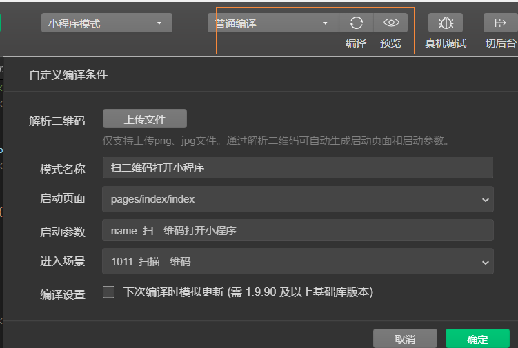

### **修改js来显示启动模式**

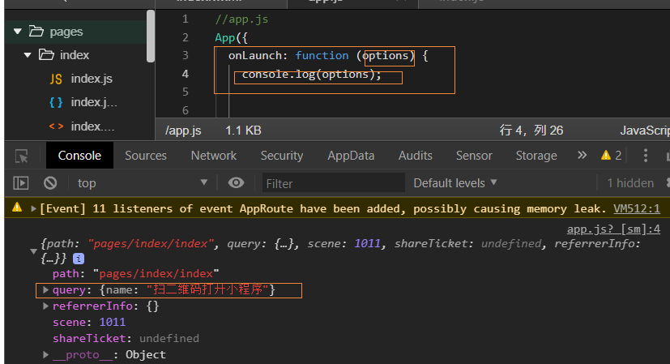

- ```javascript
  onLaunch: function (options) {
      console.log(options);
      
      // 展示本地存储能力
      var logs = wx.getStorageSync('logs') || []
      logs.unshift(Date.now())
      wx.setStorageSync('logs', logs)
  ```

- 初始代码

  ```javascript
  onLaunch: function () {
      // 展示本地存储能力
      var logs = wx.getStorageSync('logs') || []
      logs.unshift(Date.now())
      wx.setStorageSync('logs', logs)
  ```

- 普通编译

  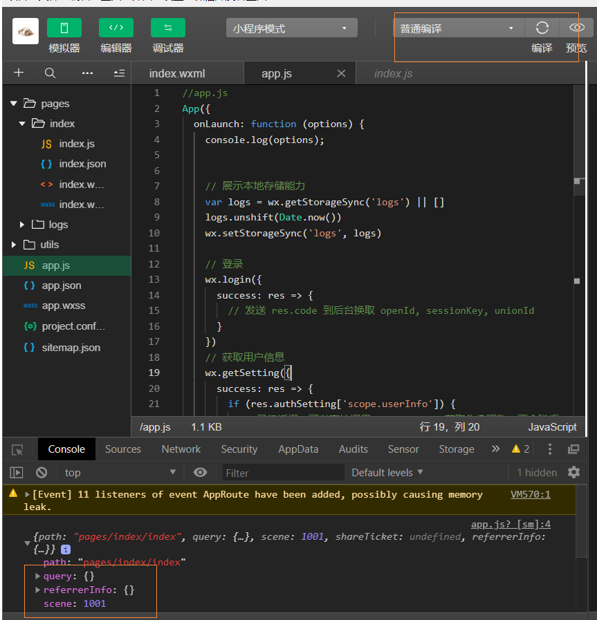

### **预览获取二维码**

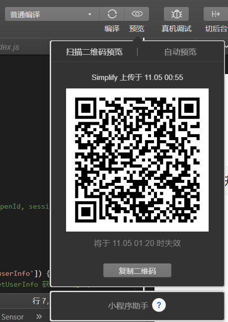

### git**的版本管理**

- 版本管理—初始化git仓库—确定

- 在`index.js`文件中加入

```javascript
  //1.打印一个文本
  showText:function(){
    console.log('打印一个文本')
  },
```

- 版本控制—工作区—简单描述一下

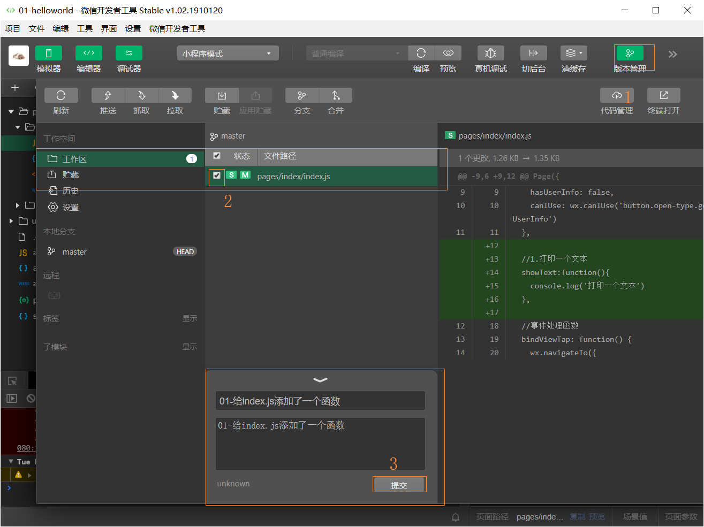

#### 查看

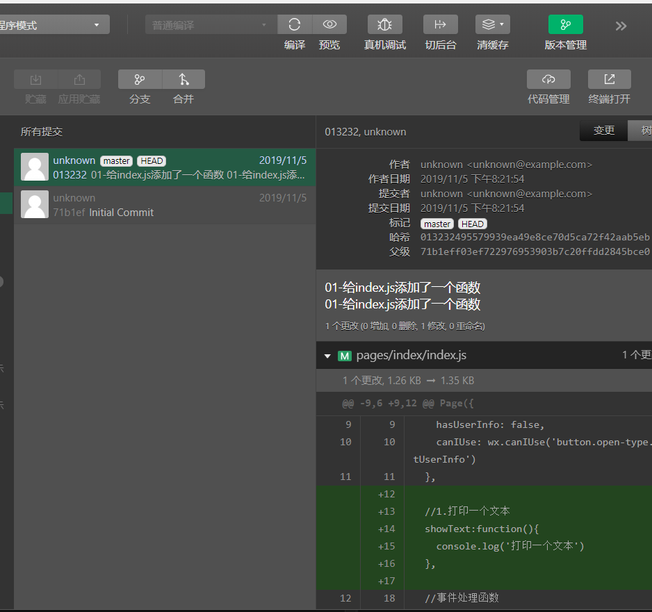

- 右键可以重置

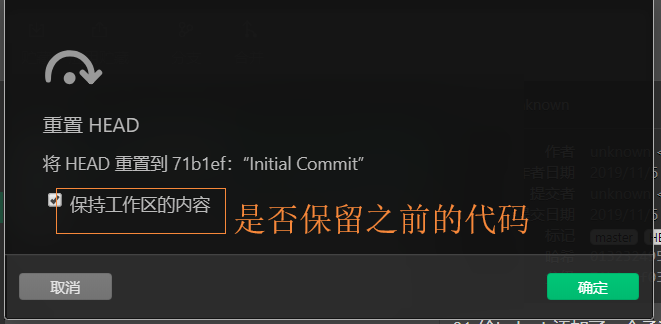

#### Git 状态

| 图标   | 含义                                                    |
| ------ | ------------------------------------------------------- |
| U      | **文件未追踪**（Untracked）, 没执行 git add             |
| A      | 新文件（Added, Staged）,                                |
| M      | **文件有修改**（Modified）                              |
| +M     | 文件有修改（Modified, Staged）,  是撤销过已提交过的文件 |
| C      | **文件有冲突**（Conflict）                              |
| D      | **文件被删除**（Deleted）                               |
| 小红点 | 目录下至少存在一个**删除状态**的文件                    |
| 小橙点 | 目录下至少存在一个**冲突状态**的文件                    |
| 小蓝点 | 目录下至少存在一个**未追踪状态**的文件                  |
| 小绿点 | 目录下至少存在一个**修改状态**的文件                    |

#### 创建分支

- 右键版本—从提交“xxxxxxx”创建分支

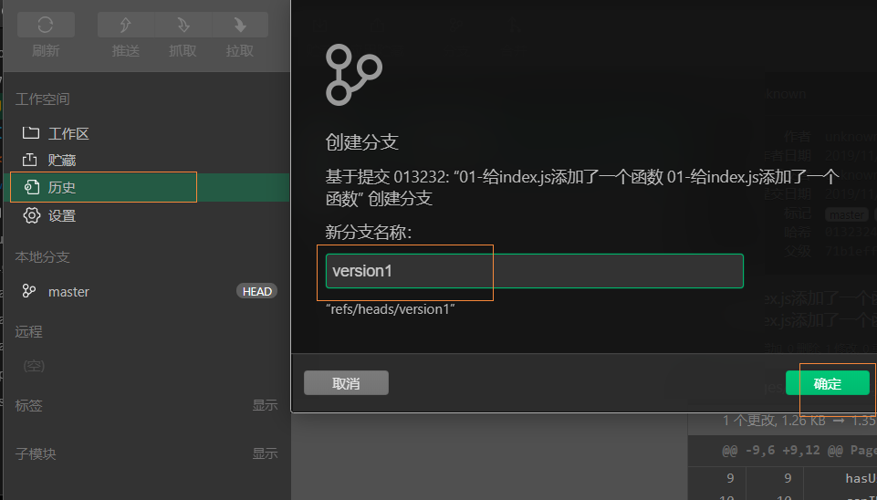

- 右键`version1`，检出

#### **合并分支**

- 选择要被合并的（非主分支）

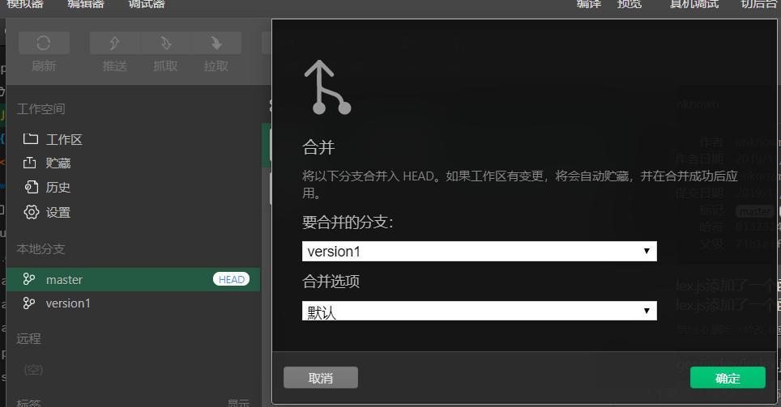

#### **制造冲突**

- 修改分支

> 注意：主分支也要修改同一个地方的代码

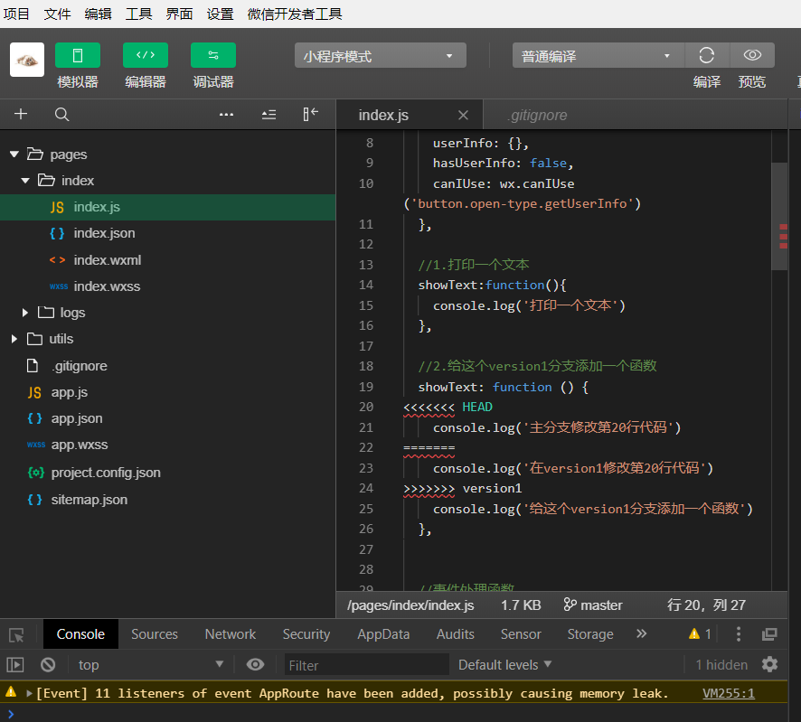

- 解决冲突：
  - 去掉三行报错，手动调正代码的位置
  - 提交

#### **提交**

- 推送到远程仓库


### 项目的目录结构

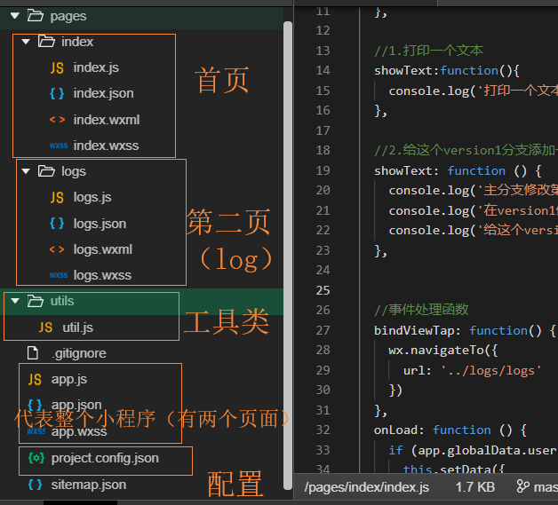s

- 必要元素

  - 在每一个页面文件的`.js`文件中必须要有`Page()`函数

  - 在配置文件`app.js`文件中必须要有`App()`函数


## view组件和样式的3种写法

### **view**

- 视图容器

| 属性名                 | 类型    | 默认值 | 说明                                                         | 最低版本                                                     |
| ---------------------- | ------- | ------ | ------------------------------------------------------------ | ------------------------------------------------------------ |
| **hover-class**        | String  | none   | 指定按下去的样式类。当 `hover-class="none"` 时，没有点击态效果。或者`hover-class="className"`, **例如：监听按下时改变view背景的透明度** |                                                              |
| hover-stop-propagation | Boolean | false  | 指定是否阻止本节点的祖先节点出现点击态                       | [1.5.0](https://mp.weixin.qq.com/debug/wxadoc/dev/framework/compatibility.html) |
| hover-start-time       | Number  | 50     | 按住后多久出现点击态，单位毫秒                               |                                                              |
| hover-stay-time        | Number  | 400    | 手指松开后点击态保留时间，单位毫秒                           |                                                              |

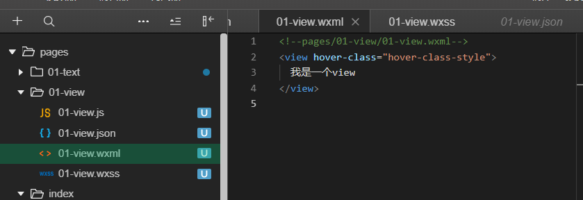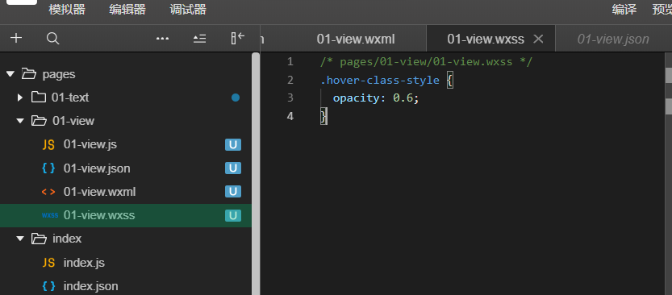

```  html
<view 
  hover-class="hover-class-style"
  hover-stay-time="100"
>
  我是一个view
</view>

<view hover-start-time="100">
  我是第2个
</view>
```

### **三种样式的写法**

- 第一种：行内样式`<view style='color:red;font-size:20rpx'> </view>`

  **代码**：

  ```css
    <view style="background:red; color:white">我是一个view1</view>
  ```

- 第二种：页内样式`  <view class='view-style' > </view>`

  **代码**：

  ```css
  /* 导入外部的样式 */
  @import '../../style/base.wxss';
  
  /* pages/01-view/01-view.wxss */
  .hover-class-style{
    opacity: 0.6;
  }
  
  .text2-style{
    background: skyblue;
    height: 100rpx;
  }
  ```

- 第三种：外部样式（ 全局样式，引用外部样式 ） ` <view class='app-style other-style'></view>`

  - （一）：

  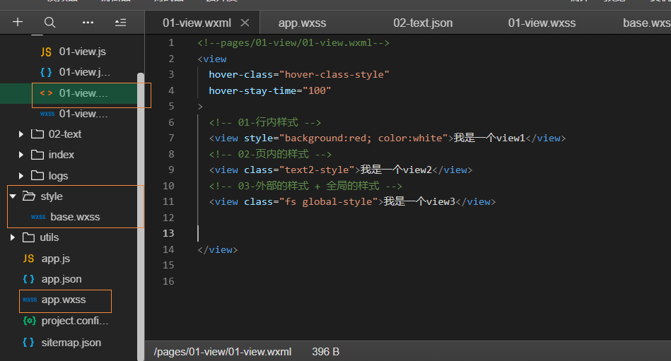

  - （二）：
    - 代码**:
    - `app.wxss`**：公共CSS**

  ```css
  /**app.wxss**/
  .container {
    height: 100%;
    display: flex;
    flex-direction: column;
    align-items: center;
    justify-content: space-between;
    padding: 200rpx 0;
    box-sizing: border-box;
  } 
  
  .global-style{
    color: blue;
  }
  ```

### 支持的选择器

目前支持的选择器有：

| 选择器            | 样例             | 样例描述                                           |
| ----------------- | ---------------- | -------------------------------------------------- |
| .class            | `.intro`         | 选择所有拥有 class="intro" 的组件（类选择器）      |
| `#id`             | `#firstname`     | 选择拥有 id="firstname" 的组件（id 选择器）        |
| element           | `view`           | 选择所有 view 组件（标签选择器）                   |
| element , element | `view, checkbox` | 选择所有的 view 组件和所有的 checkbox 组件（并列） |
| ::after           | `view::after`    | 在 view 组件后边插入内容( **伪元素**选着器  )      |
| ::before          | `view::before`   | 在 view 组件前边插入内容( **伪元素**选着器  )      |

## text组件和指令使用

### 简单的使用

- 新建一个目录
  - 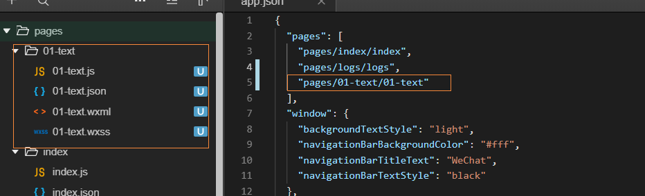

  - 或者右击pages文件夹，新建page

- text中的内容是不换行的

### 数据绑定

- 在`js`文件中定义变量

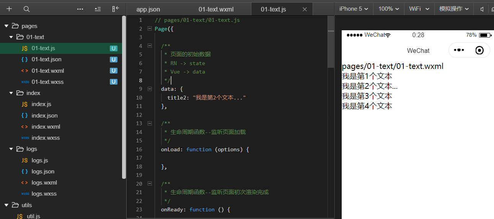

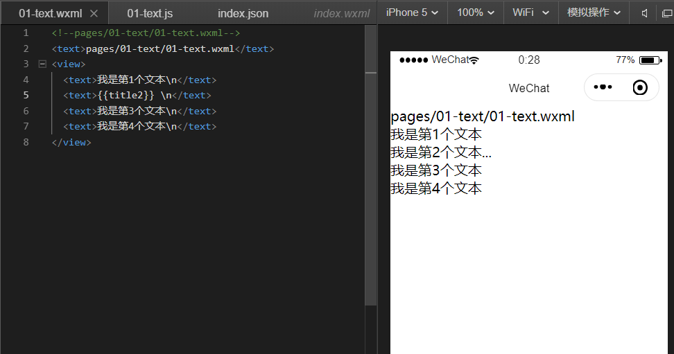

- 隐藏某个元素

  `<text style="display=none">xxxxxx</text>`

  - **法一**：hidden属性的本质上是宽高等于0

  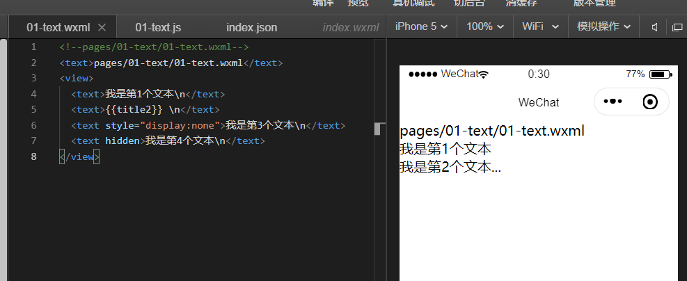

  - **法二**：在`js`中如果为`ture`，则添加这个标签；如果为`false`，则删除这个标签
  
  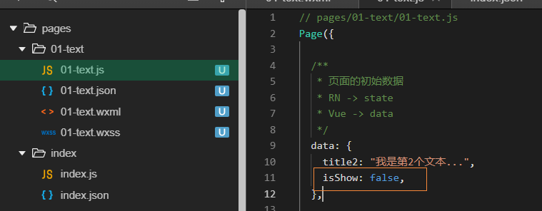
  
  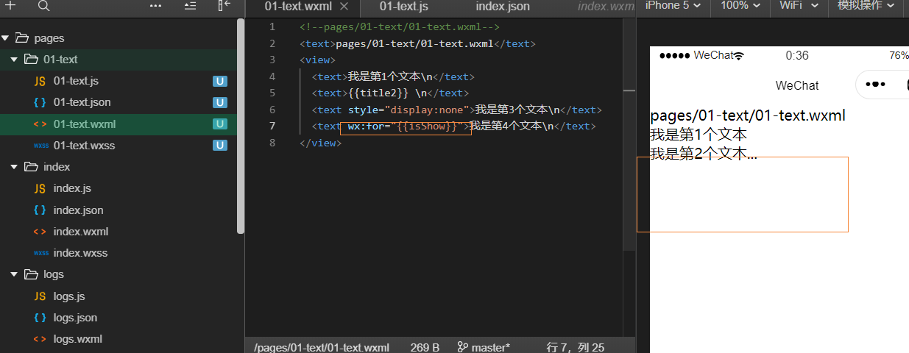
  
  - **法三**：使用`wx:if`
  
    **布尔类型数据必须放在`{{true/false}}`中**
    
    - `wx:if` 是**惰性的**，如果在**初始**渲染条件为 `false`，框架什么也不做，在条件**第一次变成true**的时候才开始局部渲染。( 为true添加组件，为false删除组件 )
  - `wx:if="{{true}}"`为显示内容
    - `wx:if="{{false}}"`隐藏内容
    
    ```html
    <!--pages/01-text/01-text.wxml-->
    <text>pages/01-text/01-text.wxml</text>
    <view>
      <text>我是第1个文本\n</text>
      <text>{{title2}} \n</text>
      <text style="display:none">我是第3个文本\n</text>
      <text wx:if="{{isShow}}">我是第4个文本\n</text>
      <text wx:if="{{false}}">我是第5个文本\n</text>
    </view>
    ```
  
- 如果需要**频繁**切换的情景下，用 `hidden` 更好，

- 如果在运行时条件不大可能改变则 `wx:if` 较好。

> 注意：给组件添加 `hidden` 属性相当于添加了width, height等于0的样式。一旦隐藏就不在占据位置;

#### **条件渲染**

```html
<view wx:if="{{length > 5}}"> 1 </view>
<view wx:elif="{{length > 2}}"> 2 </view>
<view wx:else> 3 </view>
```

## Image组件

- **官方文档链接**：https://mp.weixin.qq.com/debug/wxadoc/dev/component/image.html

- **注：**
  - **image组件默认宽度300rpx、高度225rpx**
  - **image组件中二维码/小程序码图片不支持长按识别。仅在wx.previewImage中支持长按识别**

- ### 加载项目中的图片

  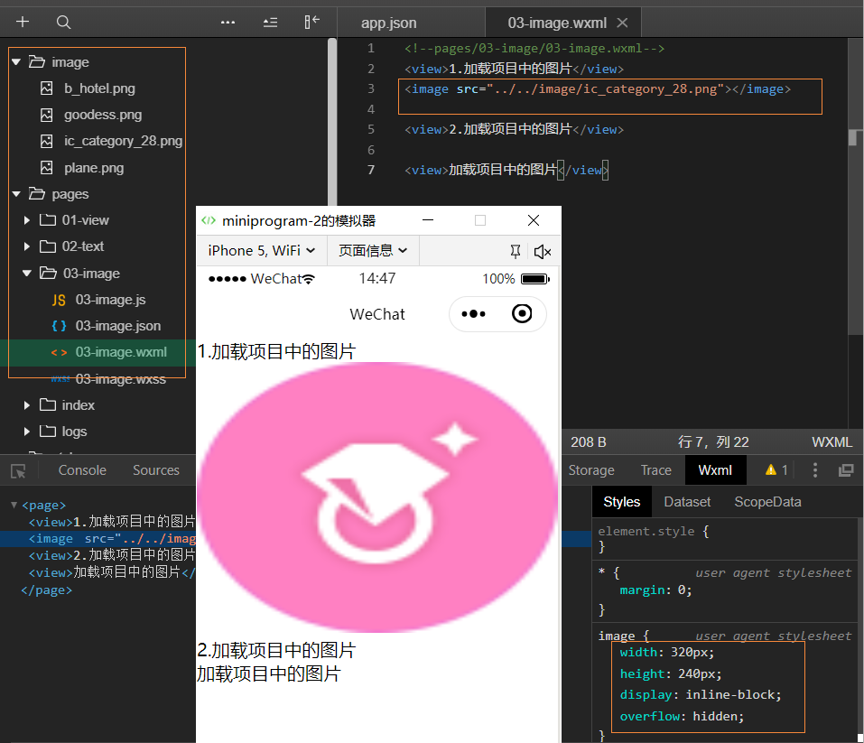

- ### 加载网络中的图片

- #### **图片缩放与裁剪：**

  - 属性：**mode="   "**
  - **文档地址：https://mp.weixin.qq.com/debug/wxadoc/dev/component/image.html**

  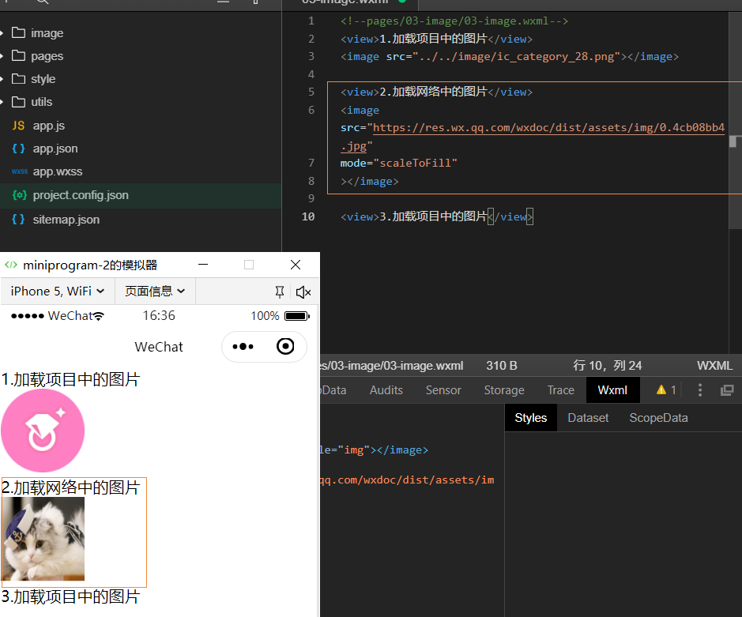

- 代码：

  ```html
  <!--pages/03-image/03-image.wxml-->
  <view>1.加载项目中的图片</view>
  <image src="../../image/ic_category_28.png"></image>
  
  
  <view>2.加载网络中的图片</view>
  <image 
         src="https://res.wx.qq.com/wxdoc/dist/assets/img/0.4cb08bb4.jpg"
  	   mode="scaleToFill"
  >
  </image>
  ```

## 携程案例

- ### 列表渲染

  #### `wx:for`

  - 在组件上使用 `wx:for` 控制属性绑定一个数组，即可使用数组中各项的数据重复渲染该组件。
  - **默认数组的当前项的下标变量名默认为 `index`**
  - **数组当前项的变量名默认为 `item`**

- **`block`代码块放指令**

  - `wx:for-item="item"`：修改默认的变量名
  - `wx:for-index="index"`：修改默认当前项的下表变量名
  - `wx:key `：标识唯一的item
  - block代码：

  ```html
  <block
    wx:for="{{ itemBeans }}"
    wx:for-item="item"
    wx:for-index="index"
    wx:key= "{{ index }}"  
    >
  </block>
  ```

- **完整代码示例**:

  ```html
  <block wx:key="{{index}}" wx:for="{{itemBeans}}" >
    <view class="view1-style" 
          style="background:{{item.bgColor}}">
  
  	    <!-- 左边 -->
      <view class="view-left-style">
          <text>{{item.title}}</text>
          <image src="{{item.imageUrl}}">{{}}</image>
      </view>
      <!-- 右边 -->
      <view class="view-right-style">
          <!-- 上边 -->
          <view class="view-r-t-style">
              <text>{{ item.items[0].title }}</text>
              <text>{{ item.items[1].title }}</text>
          </view>
          <!-- 下边 -->
          <view class="view-r-t-style">
              <text>{{ item.items[2].title }}</text>
              <text>{{ item.items[3].title }}</text>
          </view>
      </view>
    </view>
  </block>
  ```

- `xmss`代码：

  ```css
    font-size: 32rpx;
  }
  
  /* 左边 */
  .view-left-style{
    flex: 1;
    display: flex;
    flex-direction: column;
    justify-content: center;
    align-items: center;
    border-bottom: 1rpx solid white;
  }
  
  /* .view-left-style text{
    font-size: 32rpx;
  } */
  
  .view-left-style image{
    width: 100rpx;
    height: 100rpx;
    margin-top: 5rpx;
  }
  
  /* 右边 */
  .view-right-style{
    flex: 2;
    display: flex;
    flex-direction: column;
  }
  
  .view-r-t-style{
    flex: 1;
    display: flex;
    flex-direction: row;
  }
  
  .view-r-t-style text{
    flex: 1;
  
    /* 居中 */
    /* text-align: center;
    line-height: 100rpx; */
    display: flex;
    justify-content: center;
    align-items: center;
  
    /* 分界线 */
    border-left: 1rpx solid white;
    border-bottom: 1rpx solid white;
  }
  
  .view-r-b-style{
    flex: 1;
    background: pink;
  }
  ```

- `js`代码：

  ```js
  Page({
  
    /**
    * 页面的初始数据
    * 状态机（ 变量 ） 
    * this.state={ itemBeans:[xxx:xxx] }
    */
    data: {
      itemBeans: [
        {
          "type": 0,
          "imageUrl": "../../image/b_hotel.png",
          "title": "酒店",
          "tagUrl": "",
          "items": [
            { "imageUrl": "", "title": "海外酒店", "tagUrl": "" },
            { "imageUrl": "", "title": "团购", "tagUrl": "" },
            { "imageUrl": "", "title": "特价酒店", "tagUrl": "" },
            { "imageUrl": "", "title": "民宿酒店", "tagUrl": "" }
          ],
          "bgColor": "#FB5265"
        },
  
        {
          "type": 0,
          "imageUrl": "../../image/plane.png",
          "title": "机票",
          "tagUrl": "",
          "items": [
            { "imageUrl": "", "title": "火车盘票", "tagUrl": "http://images4.c-ctrip.com/target/zc010i0000009iwizFEDF.png_.webp" },
            { "imageUrl": "", "title": "汽车票.船票", "tagUrl": "" },
            { "imageUrl": "", "title": "特价机票", "tagUrl": "" },
            { "imageUrl": "", "title": "专车.租车", "tagUrl": "" }
          ],
          "bgColor": "#3C99FF"
        },
  
        {
          "type": 0,
          "imageUrl": "../../image/goodess.png",
          "title": "旅游",
          "tagUrl": "",
          "items": [
            { "imageUrl": "", "title": "目的地攻略", "tagUrl": "" },
            { "imageUrl": "", "title": "游轮旅游", "tagUrl": "" },
            { "imageUrl": "", "title": "周边游", "tagUrl": "" },
            { "imageUrl": "", "title": "定制旅行", "tagUrl": "" }
          ],
          "bgColor": "#50C72D"
        },
  
      ],
  
  
    },
  
    /**
     * 生命周期函数--监听页面加载
     */
    onLoad: function (options) {
  
    },
  
    /**
     * 生命周期函数--监听页面初次渲染完成
     */
    onReady: function () {
  
    },
  
    /**
     * 生命周期函数--监听页面显示
     */
    onShow: function () {
  
    },
  
    /**
     * 生命周期函数--监听页面隐藏
     */
    onHide: function () {
  
    },
  
    /**
     * 生命周期函数--监听页面卸载
     */
    onUnload: function () {
  
    },
  
    /**
     * 页面相关事件处理函数--监听用户下拉动作
     */
    onPullDownRefresh: function () {
  
    },
  
    /**
     * 页面上拉触底事件的处理函数
     */
    onReachBottom: function () {
  
    },
  
    /**
     * 用户点击右上角分享
     */
    onShareAppMessage: function () {
  
    }
  })
  ```

## 原生组件的使用限制

由于原生组件脱离在 `WebView` 渲染流程外，因此在使用时有以下限制：

- 原生组件的层级是最高的，所以页面中的其他组件无论设置`z-index`为多少，都无法盖在原生组件上。
  - 后插入的原生组件可以覆盖之前的原生组件。
- 原生组件还无法在`picker-view`中使用。
  - 基础库 2.4.4 以下版本，原生组件不支持在 [scroll-view](https://developers.weixin.qq.com/miniprogram/dev/component/scroll-view.html)、[swiper](https://developers.weixin.qq.com/miniprogram/dev/component/swiper.html)、[movable-view](https://developers.weixin.qq.com/miniprogram/dev/component/movable-view.html) 中使用。
- 部分`CSS`样式无法应用于原生组件，例如：
  - 无法对原生组件设置 `CSS `动画
  - 无法定义原生组件为 `position: fixed`
  - 不能在父级节点使用 `overflow: hidden` 来裁剪原生组件的显示区域

## input组件

- 官方文档：https://developers.weixin.qq.com/miniprogram/dev/component/input.html

- 输入框，原生组件

- 属性
  - **value**
    
    - `value="默认值"`
    
  - **type**
    
    |    值    |        说明        |
    | :------: | :----------------: |
    |  `text`  |    文本输入键盘    |
    | `number` |    数字输入键盘    |
    | `idcard` |   身份证输入键盘   |
    | `digit`  | 带小数点的数字键盘 |
    
  - **`placeholder`**
  
    - `placeholder="{{'占位符'}}"`或者`placeholder="占位符"`
  
  - **`maxlength`**
  
    - 最大输入位数
  
  - **`bindinput`**
  
    - 键盘输入时触发
    - 可记录输入的事件，可以通过JS来打印出来
    - 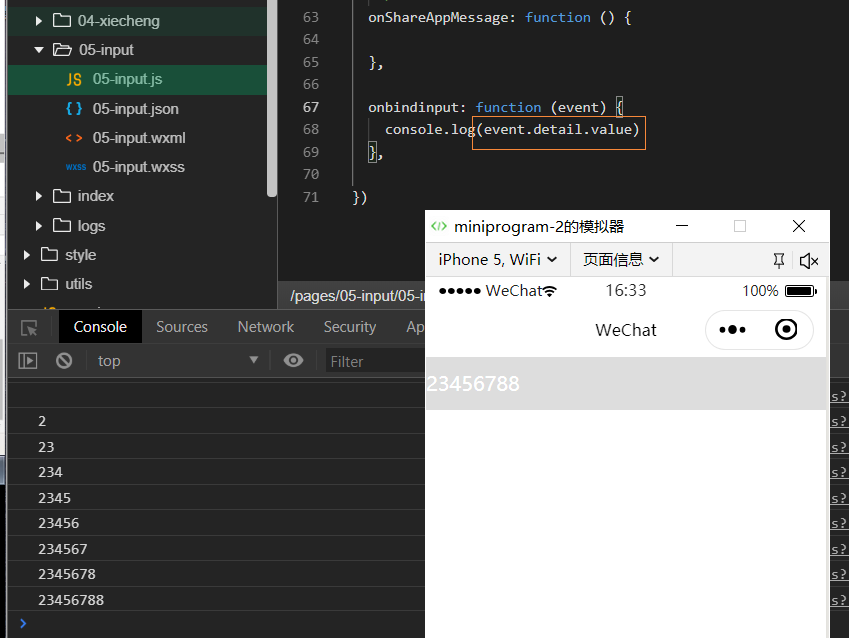
  
    ```js
    
    	data: {
        	value:''
      	},
          
    	onbindinput: function (event) {
        	console.log(event.detail.value)
        	this.setData({
          	value: event.detail.value
        	})
      },
    ```
  
  - **`bindblur`**
  
    - 失去焦点时触发
    - 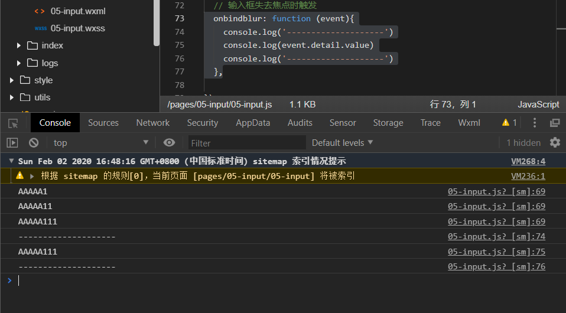
  
    ```js
      onbindblur: function (event){
        console.log('--------------------')
        console.log(event.detail.value)
        console.log('--------------------')
      },
    ```

## button组件

- **官方文档**：https://developers.weixin.qq.com/miniprogram/dev/component/button.html

  - 示例代码：

    ```html
    <button size="mini">button1</button>
    <button size="mini" type="primary">button2</button>
    
    <button type="primary" plain>button3</button>
    
    <!-- 加载中（loading） -->
    <button type="primary" loading="{{ isloading }}">button4</button>
    
    <!-- 联系客服 -->
    <button type="warn" open-type="contact">打开客服电话</button>
    
    <!-- 授权用户信息（管理授权） -->
    <button type="warn" open-type="openSetting">button6</button>
    
    <!-- 反馈界面（提交反馈），出现在反馈管理 -->
    <button type="primary" open-type="feedback">feedback</button>
    
    ```

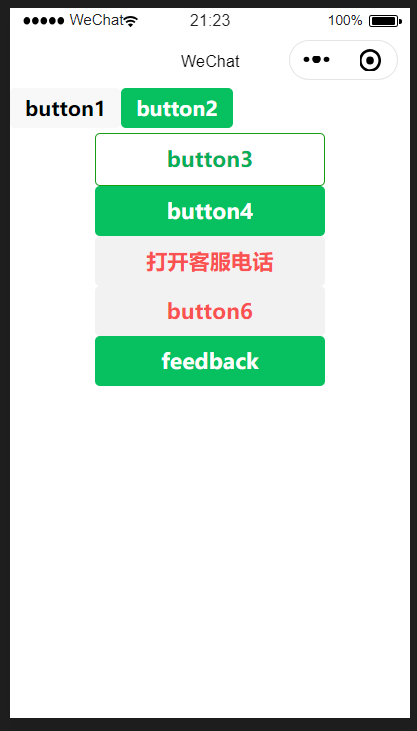

## 登录界面案例

- 让view铺满整个屏幕

- 样式：

> 1.`position : fixed`  或者 `absolute `, 可以让`view`铺满整个屏幕
>
> 2.或者给根节点page设计height : 100% , 可以让`view`铺满整个屏幕 （**推荐**）

完整`WXML`以及`WXSS`：

```html
<!--pages/07-login/07-login.wxml-->
<view class="login-content">
  
  <!-- 头部布局 -->
  <view class="login-header">
    <image src="../../image/header.jpg"></image>
    <text>小码哥</text>
    <text>广州天河棠下</text>
  </view>

  <!-- 用户名和密码 -->
  <view class="user-pass">
    <!-- 用户名 -->
    <view class="user">
      <input
        placeholder="请输入用户名"
        placeholder-class="placeholder-class-style"
      ></input>

      <image src="../../image/icon_people.png"></image>
    </view>
  
    <!-- 密码 -->
    <view>
      <view class="user">
        <input
          placeholder="请输入密码"
          placeholder-class="placeholder-class-style"
          password
        ></input>

        <image src="../../image/icon_password.png"></image>
      </view>
    </view>
  </view>
</view>
```

```css
/* pages/07-login/07-login.wxss */


.login-content{
  
  width: 100%;
  height: 100%;
  background: linear-gradient(0deg,#395ecb 0%, #3657be 35%, #242161 85%,#1a0531 100%);
  overflow: hidden;
}
.login-header{
  display: flex;
  flex-direction: column;
  align-items: center;
  /* padding-top: 130rpx; */
  margin-top: 120rpx;
  color: #ddd;
  font-size: 32rpx;
}

.login-header image{
  width: 200rpx;
  height: 200rpx;
  border-radius: 100%;
  margin: 40rpx 0rpx;
}

.login-header text:nth-of-type(1){
  margin-bottom: 20rpx;

}

.login-header text:nth-of-type(2){
  margin-bottom: 20rpx;
}

/* 用户名和密码 */
.user-pass{
  padding: 20rpx 50rpx;
}

.user{
  background: rgba(0, 0, 0, 0.2);
  height: 70rpx;
  border-radius: 70rpx;

  margin-top: 20rpx;

  position: relative;
}

.user input{
  height: 100%;
  padding-left: 110rpx;
  color: white;
  font-size: 32rpx;
}

.user image{
  width: 45rpx;
  height: 45rpx;

  position: absolute;
  top: 12rpx;
  left: 40rpx;
}

.placeholder-class-style{
  color: #999;
  font-size: 30rpx;
  
}
```

## **scroll-view组件**

- 简单用法：

  - **代码**：

    ```html
    <scroll-view>
      <view>item1</view>
      <view>item1</view>
      <view>item1</view>
      <view>item1</view>
      <view>item1</view>
      <view>item1</view>
      <view>item1</view>
      <view>item1</view>
      <view>item1</view>
      <view>item1</view>
      <view>item1</view>
    </scroll-view>
    ```

    ```css
    view {
      height: 400rpx;
      border-bottom: 2rpx solid gray;
    }
    ```

  - **效果**：

    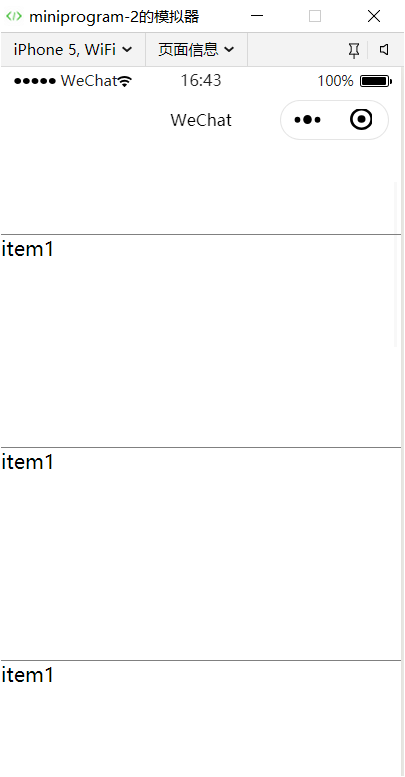

- 垂直滚动

  - **第一步：**给scroll-view添加scroll-y="{{true}}"属性

    **第二步：**给scroll-view设计高度

    >  注意：使用竖向滚动scroll-y时，需要给`scroll-view`一个固定高度，通过 WXSS 设置 height。

  - 代码：

    ```html
    <scroll-view scroll-y>
      <view>item1</view>
      <view>item1</view>
      <view>item1</view>
      <view>item1</view>
      <view>item1</view>
      <view>item1</view>
      <view>item1</view>
      <view>item1</view>
      <view>item1</view>
      <view>item1</view>
      <view>item1</view>
    </scroll-view>
    ```

    ```css
    scroll-view{
      height: 400rpx;
      background: skyblue;
    }
    
    view{
      height: 300rpx;
      border-bottom: 1rpx solid gray;
    }
    ```

  - 效果：

    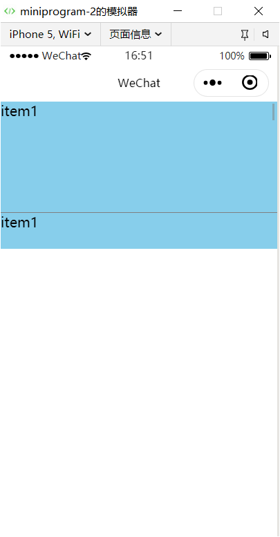

- 水平滚动

  - **第一步：**给scroll-view添加**scroll-x="{{true}}"**属性

    **第二步：**给scroll-view设计高度,  并给scroll-view添加 **white-space=‘ nowrap ’**  来强制scroll-view内容要在一行（默认内容抵达边界会换行）

    **第三步：**指定scroll-view里面的组件的类型为**行内块级标签：display: inline-block**（块级标签默认会换行）

    布局：

    ```html
    <view>
    <text>2.水平滚动</text>
    <scroll-view scroll-x="true">
      <view>view1</view>
    	...
    </scroll-view>
    
    </view>
    ```

  - 代码：

    ```html
    <!-- 1.指定scroll-view为水平滚动 -->
    <scroll-view scroll-x>
      <view>item1</view>
      <view>item1</view>
      <view>item1</view>
      <view>item1</view>
      <view>item1</view>
      <view>item1</view>
      <view>item1</view>
      <view>item1</view>
      <view>item1</view>
      <view>item1</view>
      <view>item1</view>
    </scroll-view>
    ```

    ```css
    scroll-view {
      height: 300rpx;
      background: skyblue;
    
      /* 2.指定scroll-view里面的内容不能换行 */
      white-space: nowrap;
    }
    
    view {
      /* 3.指定位行内块级标签 */
      display: inline-block;
      width: 200rpx;
      height: 100%;
      border: 1rpx solid gray;
    }
    ```

    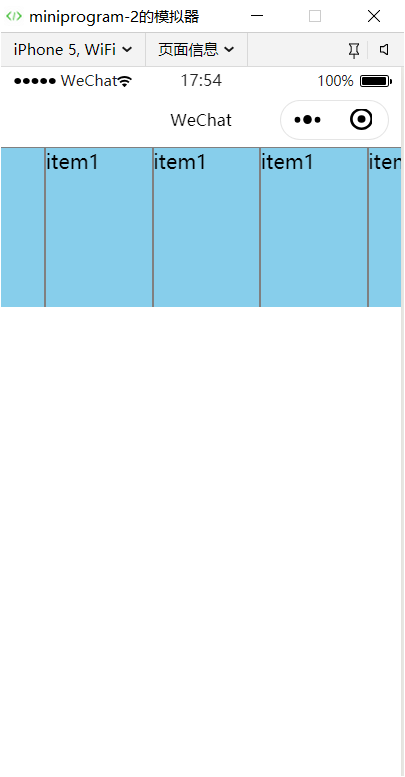

## 开眼案例

- **代码**:

  - ```html
    <!--pages/11-open-eye/11-open-eye.wxml-->
    <scroll-view scroll-y>
      <block wx:for="{{itemsData}}" wx:key="{{index}}">
        <view class="view-style" style="background:url({{item.image}}) center center;background-size:cover">
          <text>{{item.title}}</text>
          <text>{{item.slogan}}</text>
          <image src="{{item.icon}}"></image>
        </view>
      </block>
    </scroll-view>
    ```

  - ```css
    /* pages/11-open-eye/11-open-eye.wxss */
    scroll-view{
      height: 100%;
      background: skyblue;
    }
    
    .view-style{
      height: 400rpx;
      border-bottom: 1rpx solid white;
      width: 100%;
      
    
      /* 弹性布局 */
      display: flex;
      flex-direction: column;
      justify-content: center;
      align-items: center;
    
      color: white;
    }
    
    .view-style text:nth-of-type(1){
      font-size: 40rpx;
    }
    
    .view-style text:nth-of-type(2){
      font-size: 32rpx;
      margin: 20rpx 0rpx;
    }
    
    .view-style image{
      width: 100rpx;
      height: 100rpx;
    }
    ```

  - ```js
    itemsData: [
          {
            "id": 55172,
            "title": "好好的自行车公路赛为何演变成这样？",
            "slogan": "这位老兄，你骑跑偏了知道吗？",
            "description": "看 Vittorio Brumotti 在意大利小镇利维尼奥撒个野。花式骑车很精彩，可好担心他找不到回家的路啊！From Tinkoff Team",
            "image": "http://img.kaiyanapp.com/4c223bf6756ed7185a36578739548443.jpeg?imageMogr2/quality/60/format/jpg",
            "icon": "http://img.kaiyanapp.com/fa20228bc5b921e837156923a58713f6.png"
          },
          {
            "id": 57039,
            "title": "来自美国太空旅行的花样死法",
            "slogan": "宇航员是一项危险的职业！",
            "description": "这支趣味短片来自美国明尼苏达州的 MAKE 工作室，给我们带来了宇航员的「危险生活」，一言不合就上天…… From makevisual",
            "image": "http://img.kaiyanapp.com/74de057be52356ef10ea6e9ce8e3604f.jpeg?imageMogr2/quality/60/format/jpg",
            "icon": "http://img.kaiyanapp.com/fa20228bc5b921e837156923a58713f6.png"
          },
          {
            "id": 14336,
            "title": "魔术解密：关于小球的 7 种技巧",
            "slogan": "人人都是魔术师，你学会了吗？",
            "description": "这期 Evan Era 给我们传授了 7 个常见的魔术技巧，想知道魔术师是怎么做到的吗？一起来学习一下吧！From EvanEraTV\n",
            "image": "http://img.kaiyanapp.com/117ee8871128660a9776997eee3e2c77.jpeg?imageMogr2/quality/60/format/jpg",
            "icon": "http://img.kaiyanapp.com/fa20228bc5b921e837156923a58713f6.png"
          },
          {
            "id": 56817,
            "title": "Friday night！一起放松一下 ",
            "slogan": "原来十根手指可以做出这么多变化",
            "description": "终于可以离开办公室，享受美好的周末夜晚。不过再精彩的夜生活也吸引不了我，因为我的注意力从头到尾全放在他手上！还是第一次知道，原来十只手指头可以做出这么多种变化……",
            "image": "http://img.kaiyanapp.com/7050f9ee1b5a562bfb49023c07da8344.jpeg?imageMogr2/quality/60/format/jpg",
            "icon": "http://img.kaiyanapp.com/fa20228bc5b921e837156923a58713f6.png"
          },
          {
            "id": 57256,
            "title": "创意拼贴 MV：「尚未出世的死亡与生命」",
            "slogan": "成长就是这样，混混沌沌却也惊喜常常",
            "description": "葡萄牙女歌手 Paula Cavalciuk「Morte E Vida Uterina」的 MV 讲述了一个正在走向成熟的女孩的不知所措，但面对成人世界，她必须找到内心的力量。From Daniel Bruson",
            "image": "http://img.kaiyanapp.com/e2a9c5e7de30492c7121b6123af0e471.jpeg?imageMogr2/quality/60/format/jpg",
            "icon": "http://img.kaiyanapp.com/fa20228bc5b921e837156923a58713f6.png"
          },
          {
            "title": "看法国滑翔伞大师玩转天空",
            "slogan": "这才是真正的「放飞自我」",
            "description": "Jean 是有十多年经验的法国滑翔伞专家，他飞跃了葡萄牙、法国与南非，拍摄而成这条短片，为的就是要「让所有人都能体验到飞行的自由」。 BGM 来自瑞典民谣组合 First Aid Kit 的「My Silver Lining」。From Jean-Baptiste CHANDELIER",
            "image": "http://img.kaiyanapp.com/f064c00a2a23e5ee3ff71a4fb74e033d.jpeg?imageMogr2/quality/60/format/jpg",
            "icon": "http://img.kaiyanapp.com/fa20228bc5b921e837156923a58713f6.png"
    
          }
    
        ]
    ```

    