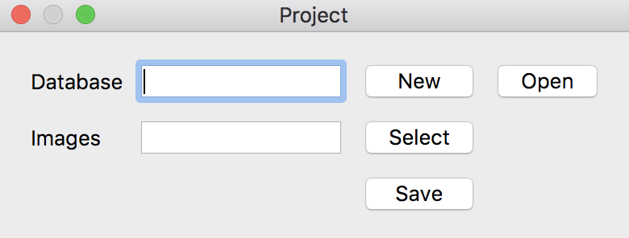
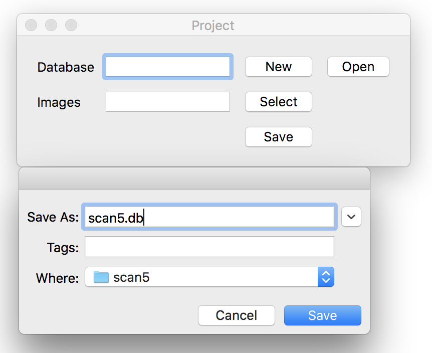
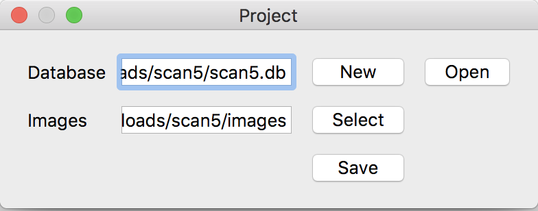
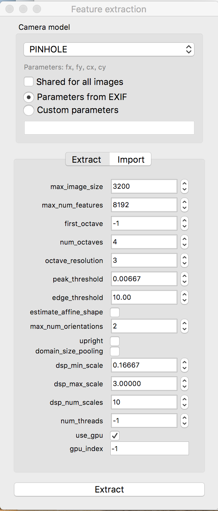
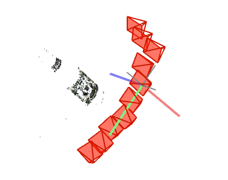
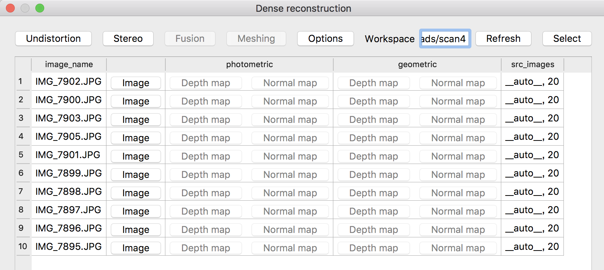
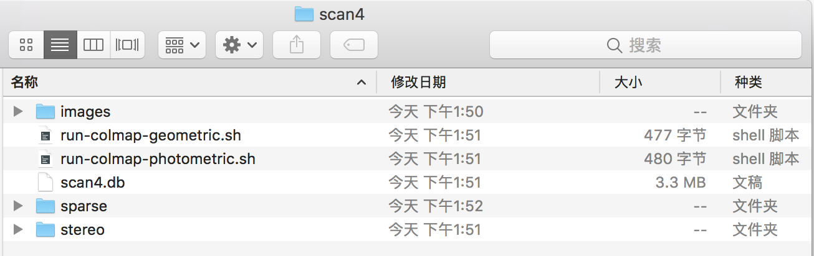
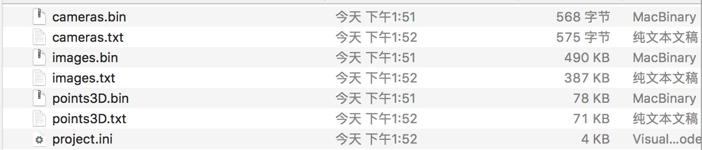

### Fast-MVSNet文件夹中的代码功能如下：

配置文件为configs中的yaml文件，需要根据数据放置位置修改绝对路径。

solver.py为网络中的优化器子结构

config.py文件生成配置文件中的初始参数

train.py为训练文件

test.py为最终能够生成深度图的测试文件

fusion.py能够把深度图转化为三维点云文件（Ubuntu18.04+OpenCV C++环境）

outputs文件夹存放最终的输出结果

tools文件夹中存放功能函数

#### 在自采数据集上测试MVSNet系列神经网络

现有的方法和教程大多在数据准备好的前提下来测试MVSNet系列神经网络，却没有完整的提到对自采数据预处理的过程。下面对这部分的各步骤做出详细解释：

与直接使用dtu数据集不同，如果要使用自己拍摄的图片完成三维重建，需要完成以下步骤的数据预处理，把图片变为和dtu数据集同样的格式，也是神经网络需要的格式：

1. 下载COLMAP软件（Mac、Windows平台均可），预先准备好一个项目文件夹，这里的示例中命名为scan5。

2. 选择左上角“File”，在COLMAP图形化界面中新建一个项目，同时点击"New"新建一个Database，Database的命名和项目文件夹一致即可，也就是命名为scan5.db；之后在Image处选取自己拍摄的图片所在的文件夹，选取完毕后点击"Save"，即可生成项目。

   

   

     

   

   - 注：这里对Images文件夹下图片的名称没有要求，之后会统一生成，也需要统一修改。

3. 选择左上角“Processing”，依次进行Feature Extraction和Feature Matching，其中Feature Extraction中，Camara Model要选择PINHOLE，Feature Matching中全部选用默认参数。

   

4. 特征提取与匹配完成后，选择左上角“Reconstruction”，点击"Start Reconstruction"，即可看到一张张图片加入、匹配时，稀疏点云重建的过程。

   

5. 稀疏重建完成后，选择上图中的“Dense Reconstruction”，也就是稠密重建。指定好工程文件夹，选择undistortion，进行图像纠正。



​       这时的工程文件夹如下：

        

6. 纠正完成后，不要进行Stereo等步骤（这部分工作将由MVSNet系列神经网络完成），选择"File"-"Export Model as txt"，目标文件夹选取工程文件夹中的sparse文件夹。导出后的sparse文件夹如下：



7. 根据MVSNet代码库中的colmap2mvsnet.py，将scan5文件夹作为输入，即可完成colmap输出到mvsnet输入的转换。

```sh
 python colmap2mvsnet.py --dense_folder ../scan5 --test
```

​		在转换时，相机参数被生成，这些参数分别存放在pair.txt和cam_0000000x.txt文件中。

8. 路径修改和文件存放。首先，在FastMVSNet的配置文件dtu.yaml中修改TEST下data的路径为scan5的路径，之后在dataset.py中找到"DTU_test"类中"_load_dataset"函数，查看图片和相机参数文件所在的路径。我们将所有输入文件进行如下包装：图片放入文件夹images中，相机参数中，pair.txt放在scan5下，其余参数放在和scan5同级的Camera文件夹下。（这一步也可自定义）

9. 通过test.py在自采数据上完成测试。生成的pfm文件就是深度图，可以用MVSNet中的visualize.py访问：

   ```shell
    python visualize.py ../dtu/scan3/00000009_init.pfm
   ```

10. 按照MVSNet代码库的做法，由深度图通过depthfusion.py生成点云。（这一步之前要编译安装opencv和fusibile两个代码库。）

这部分的实现引用了以下两个代码库：

MVSNet https://github.com/YoYo000/MVSNet

FastMVSNet https://github.com/svip-lab/FastMVSNet


